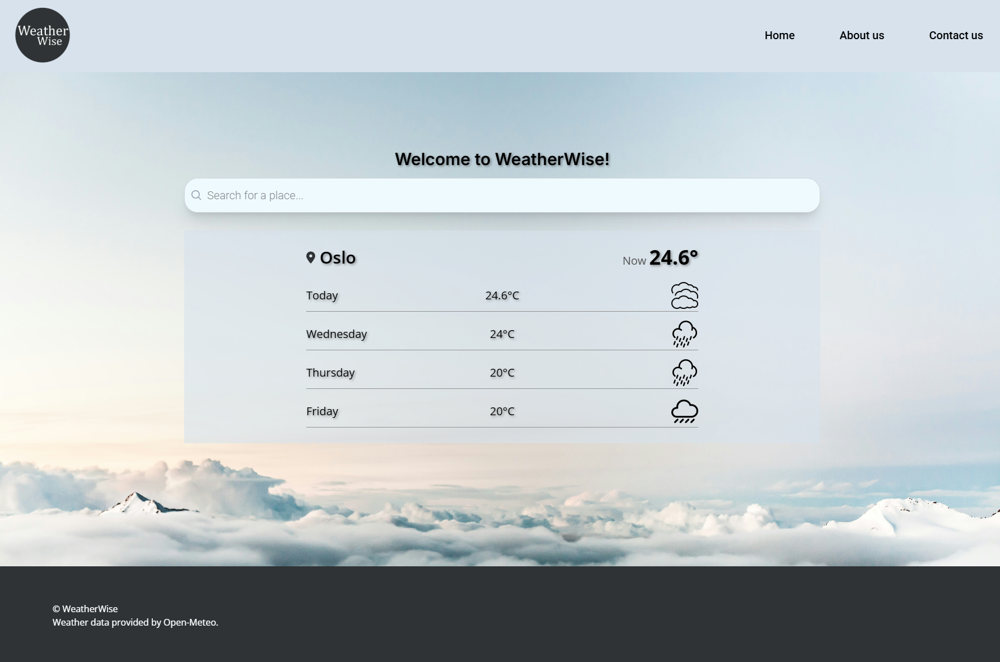

## Weather Wise



## Overview

Weather wise is a weather app I made on my own by using Next.js and Tailwind CSS. It uses a free API from Open Meteo, so you can search for all the places you want and get different search results, that takes you to the specific weather page when clicking on a link. It displays the forecasted weather of ten days for each specific weather page.

## Technologies Used

Next.js – React framework with server-side rendering and file-based routing
Tailwind CSS – Utility-first CSS framework for rapid UI development
ESLint – Linter to maintain consistent and error-free JavaScript code
Prettier – Code formatter for clean and uniform code style
Husky – Tool for managing Git hooks to automate tasks like linting and formatting before commits
TypeScript – Main programming language for building frontend logic
Vercel – Deployment platform optimized for Next.js apps

## Technical Requirements

Front-End Only: The application focuses solely on the front-end, utilizing the Open Meteo API for all back-end functionality.
Responsive Design: The website should be accessible and user-friendly on all devices.

## Getting Started

### Installation

1. **Clone the repo:**

   ```bash
   git clone https://github.com/TheRegzi/weather-wise.git
   ```

   2. **Navigate to the project directory:**

   ```bash
   cd weather-wise
   ```

2. **Install dependencies:**

   ```bash
   npm install
   ```

3. **Run the development server**:

```bash
npm run dev
# or
yarn dev
# or
pnpm dev
# or
bun dev
```

Open [http://localhost:3000](http://localhost:3000) with your browser to see the result.

## Contributing

If you want to contribute, please make a pull request so any changes can be reviewed before being merged. If you have questions or ideas, feel free to open an issue. All contributions are welcome!

## Deployment

The app is deployed at [https://weather-wise-sigma-one.vercel.app](https://weather-wise-sigma-one.vercel.app)

## Contact

[My LinkedIn Page](https://www.linkedin.com/in/regine-dille-kornbakk-aa0a7b288/)
